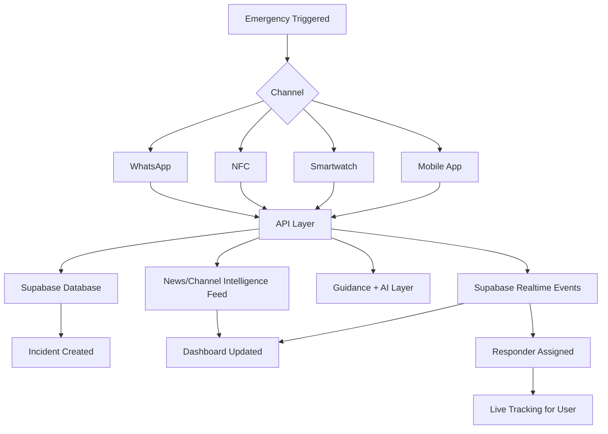
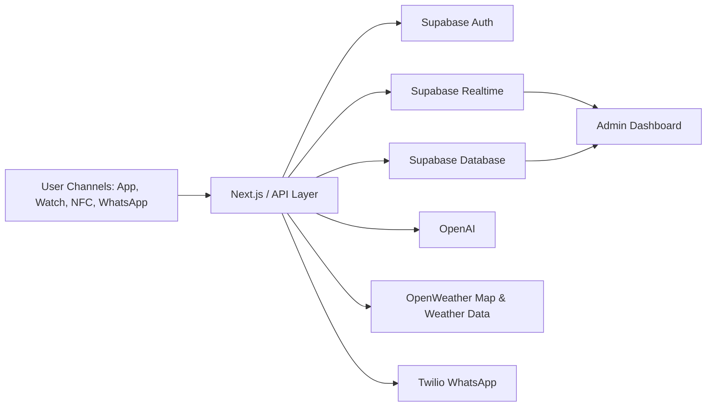
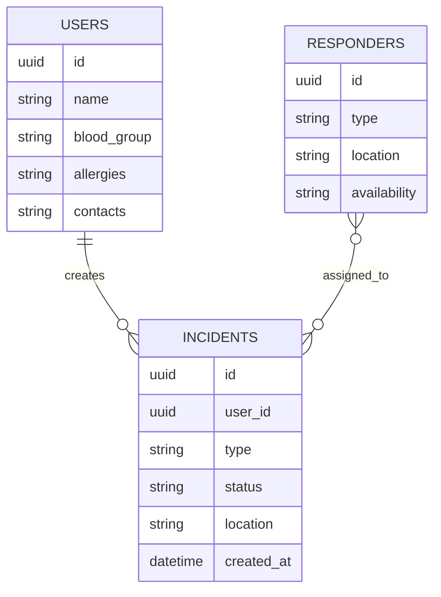
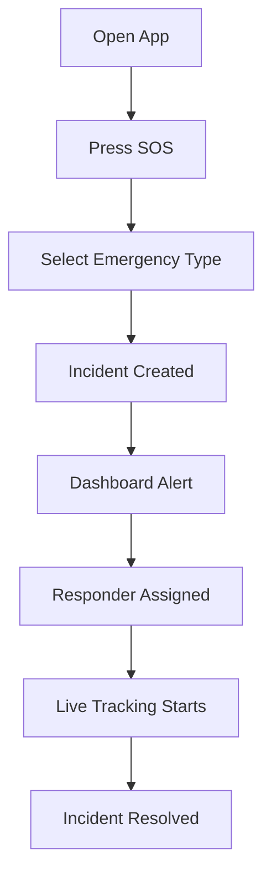

# ResQNet+

> **A unified, multi-channel emergency response platform across mobile, web dashboard, wearable trigger, NFC, and WhatsApp.**

---

## 1) Executive Summary

**ResQNet+** helps people request emergency support faster and helps responders coordinate better.

Users can trigger help through multiple entry points, while incident data, location, medical context, and updates flow into one shared real-time system.

---

## 2) Problem Statement

Current emergency workflows are often:

- Slow to initiate under stress
- Fragmented across disconnected channels
- Missing important medical context
- Difficult to track in real time

This leads to delayed decisions, slower response, and poor visibility for both users and responders.

---

## 3) Our Solution

ResQNet+ connects the full emergency journey end-to-end:

- **Trigger channels:** Mobile app, smartwatch trigger, NFC card, WhatsApp bot
- **Core flow:** Incident creation, profile lookup, responder assignment, live updates
- **Guidance layer:** Immediate first-aid support and AI-assisted suggestions
- **Intelligence feed:** Situation updates scraped from news portals and channels

---

## 4) Product Modules

### 4.1 Mobile App

- One-tap SOS activation
- Emergency type selection (medical, disaster, safety)
- Live tracking view
- Emergency profile access
- First-aid guidance

### 4.2 Smartwatch Trigger (Demo Simulation)

- Fall alert simulation
- Abnormal heart-rate simulation
- Quick SOS initiation when phone access is difficult

### 4.3 NFC Emergency Card

- Quick profile access
- Blood group, allergies, and emergency contacts
- QR fallback for compatibility

### 4.4 WhatsApp Assistant

- Emergency guidance
- Health-related support prompts
- Shelter/helpline oriented responses

### 4.5 Admin Dashboard

- Live incident feed
- Incident status management
- Responder assignment workflow
- Map and situational monitoring
- Response analytics

---

## 5) Why It Matters

| Existing Gap | ResQNet+ Response |
|---|---|
| Slow reporting | One-action emergency trigger |
| Missing medical info | Profile with blood group, allergies, contacts |
| No shared visibility | Real-time incident and assignment updates |
| Platform dependency | Multi-channel access (app, wearable, NFC, WhatsApp) |
| Weak responder coordination | Dashboard-based orchestration |

---

## 6) High-Level Workflow



---

## 7) System Architecture



---

## 8) Database Model (Core)



---

## 9) API Snapshot

### Create SOS
```http
POST /sos
Content-Type: application/json

{
  "userId": "uuid",
  "location": "lat,lng",
  "type": "medical"
}
```

### Nearby Responders
```http
GET /responders/nearby
```

### Update Incident Status
```http
PATCH /incident/:id
Content-Type: application/json

{
  "status": "in-progress"
}
```

### Chat Support
```http
POST /chat
Content-Type: application/json

{
  "message": "I have chest pain"
}
```

---

## 10) Technology Stack

| Layer | Technology |
|---|---|
| Frontend | Next.js |
| Backend | Next.js API / Express |
| Database | Supabase |
| Authentication | Supabase Auth |
| Realtime | Supabase Subscriptions |
| AI | OpenAI |
| Messaging | Twilio WhatsApp |
| Maps & Weather Context | OpenWeather |
| Hosting | Vercel / Render |

---

## 11) Demo Flow



---

## 12) Real vs Simulated (Transparency)

### Real Components

- SOS UI and incident creation
- Supabase data storage and retrieval
- Real-time dashboard updates
- User emergency profile handling
- Guided first-aid content

### Simulated Components

- Smartwatch biometric trigger events
- NFC behavior when physical hardware is unavailable
- Some movement paths/analytics values used for storytelling

---

## 13) Future Scope

- Hospital-side responder dashboard
- Government disaster-management integrations
- Voice-enabled SOS
- Multilingual AI emergency assistance
- SMS fallback for low-connectivity areas
- Smart-campus / smart-city deployment

---

## 14) One-Line Pitch

> **ResQNet+ makes emergency response connected, real-time, and accessible from any channel.**

---

## 15) Closing

In an emergency, help should be one action away, and the system behind that action should already know what to do next.
