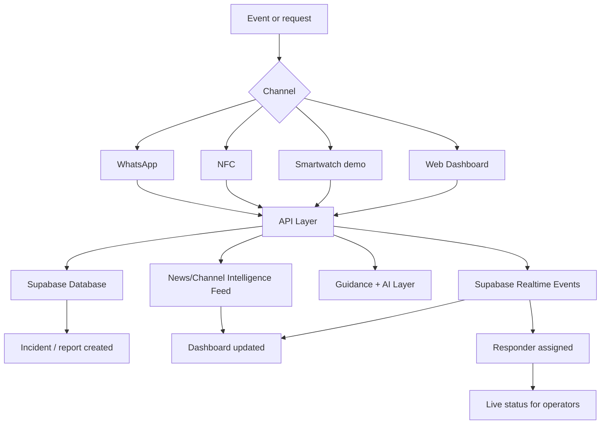
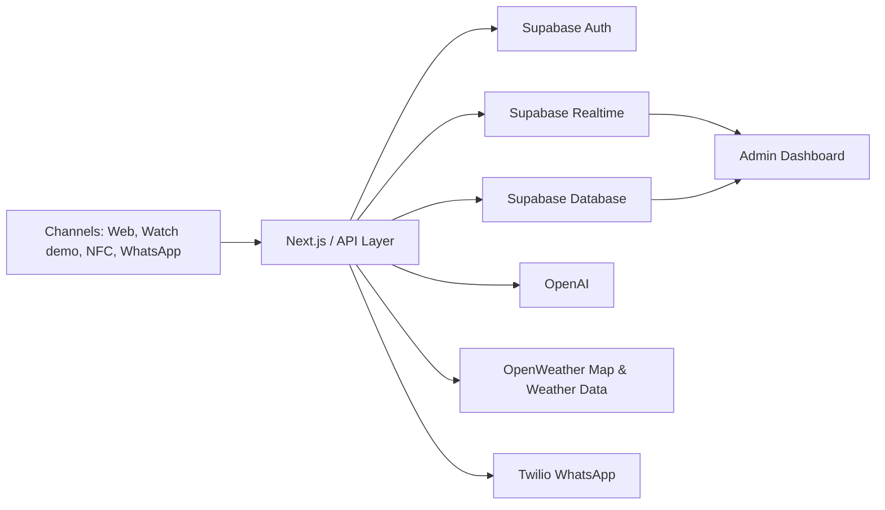
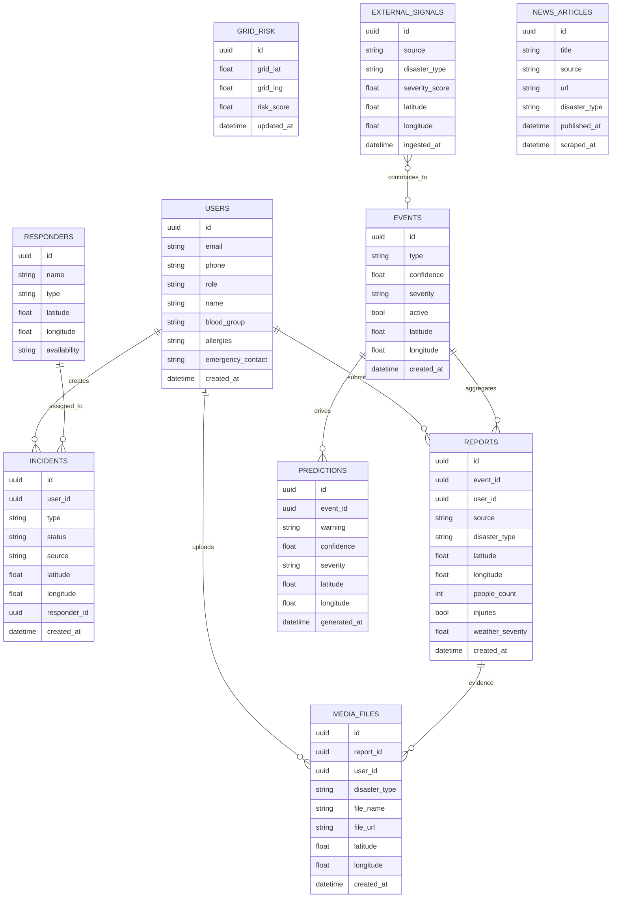
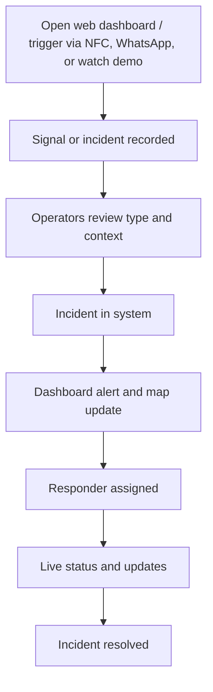

# ResQNet+

> **A unified emergency and disaster-intelligence platform: web command dashboard, wearable trigger (demo), NFC, and WhatsApp — with real-time signals, incidents, and responder coordination.**

---

## 1) Executive Summary

**ResQNet+** gives response teams a live command surface and helps everyone involved coordinate faster.

Signals and requests can arrive through the web dashboard, wearable demo, NFC, or WhatsApp; incident data, location, medical context, and updates stay in one shared real-time system.

---

## 2) Problem Statement

Current emergency workflows are often:

- Slow to initiate under stress
- Fragmented across disconnected channels
- Missing important medical context
- Difficult to track in real time

This leads to delayed decisions, slower response, and poor visibility for both users and responders.

---

## 3) Our Solution

ResQNet+ connects the full emergency journey end-to-end:

- **Primary surface:** Web dashboard for live risk signals, incident validation, maps, and orchestration
- **Trigger & access channels:** Smartwatch trigger (demo simulation), NFC emergency card, WhatsApp assistant
- **Core flow:** Incident creation, profile lookup, responder assignment, live updates
- **Guidance layer:** Immediate first-aid support and AI-assisted suggestions
- **Intelligence feed:** Situation updates scraped from news portals and channels

---

## 4) Product Modules

### 4.1 Web Command Dashboard

- Live disaster-intelligence and risk signals
- Incident feed, status workflow, and responder assignment
- Map and situational monitoring
- Real-time updates via Supabase subscriptions
- Analytics and source breakdown for reports and external signals

### 4.2 Smartwatch Trigger (Demo Simulation)

- Fall alert simulation
- Abnormal heart-rate simulation
- Quick SOS initiation for hands-free or wearable-first scenarios

### 4.3 NFC Emergency Card

- Quick profile access
- Blood group, allergies, and emergency contacts
- QR fallback for compatibility

### 4.4 WhatsApp Assistant

- Emergency guidance
- Health-related support prompts
- Shelter/helpline oriented responses

### 4.5 Intelligence & ingestion

- News and channel scraping for situation context
- External signals, events, and grid risk modeling (where enabled)

---

## 5) Why It Matters

| Existing Gap                | ResQNet+ Response                                   |
| --------------------------- | --------------------------------------------------- |
| Slow reporting              | Triggers via NFC, WhatsApp, watch demo, or dashboard |
| Missing medical info        | Profile with blood group, allergies, contacts       |
| No shared visibility        | Real-time incident and assignment updates           |
| Platform dependency         | Web-first ops plus wearable demo, NFC, and WhatsApp |
| Weak responder coordination | Dashboard-based orchestration                       |

---

## 6) High-Level Workflow



---

## 7) System Architecture



---

## 8) Database Model (API-Aligned Core)



---

## 9) API Snapshot

### Create SOS

```http
POST /sos
Content-Type: application/json

{
  "userId": "uuid",
  "location": "lat,lng",
  "type": "medical"
}
```

### Nearby Responders

```http
GET /responders/nearby
```

### Update Incident Status

```http
PATCH /incident/:id
Content-Type: application/json

{
  "status": "in-progress"
}
```

### Chat Support

```http
POST /chat
Content-Type: application/json

{
  "message": "I have chest pain"
}
```

---

## 10) Technology Stack

| Layer                  | Technology             |
| ---------------------- | ---------------------- |
| Frontend               | Next.js                |
| Backend                | Next.js API / Express  |
| Database               | Supabase               |
| Authentication         | Supabase Auth          |
| Realtime               | Supabase Subscriptions |
| AI                     | OpenAI                 |
| Messaging              | Twilio WhatsApp        |
| Maps & Weather Context | OpenWeather            |
| Hosting                | Vercel / Render        |

---

## 11) Demo Flow



---

## 12) Future Scope

- Hospital-side responder dashboard
- Government disaster-management integrations
- Voice-enabled SOS
- Multilingual AI emergency assistance
- SMS fallback for low-connectivity areas
- Smart-campus / smart-city deployment

---

## 14) Closing

In an emergency, help should be one action away, and the system behind that action should already know what to do next.
